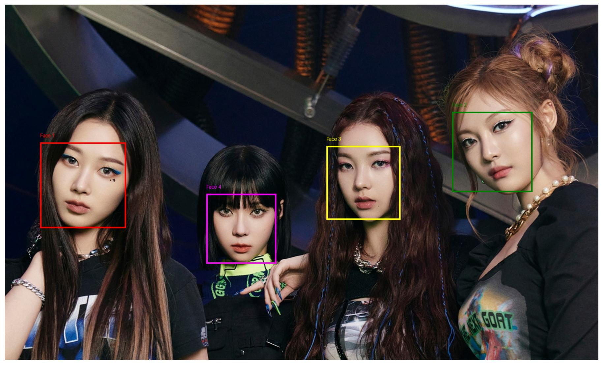
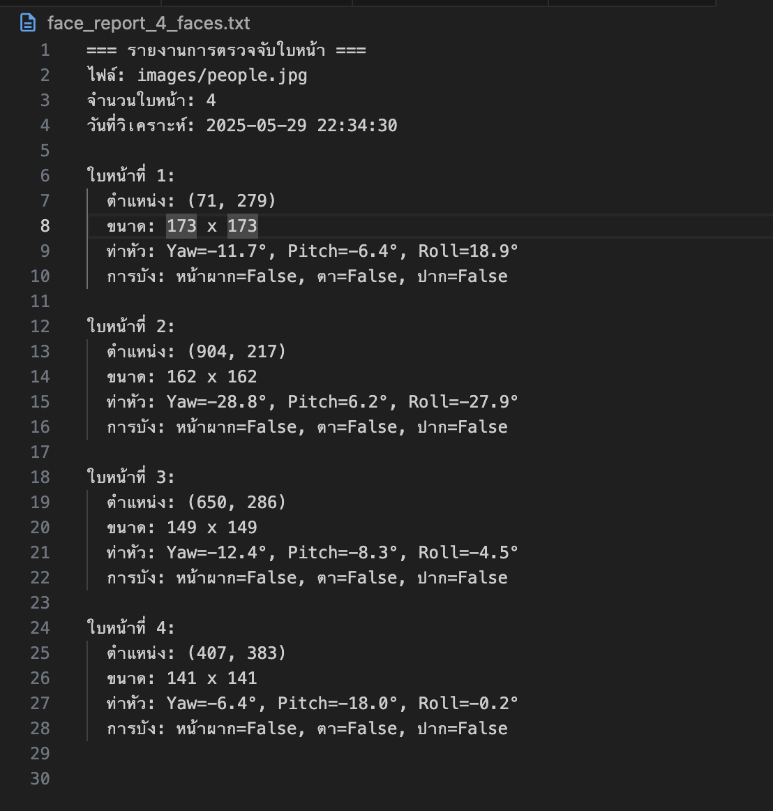

## ตัวอย่างผลลัพธ์

### ผลการตรวจจับใบหน้า


*ตัวอย่างผลลัพธ์: ตรวจพบใบหน้า 4 ใบหน้าพร้อมกรอบและหมายเลขระบุตำแหน่ง*

### รายงานผลการวิเคราะห์


*รายงานรายละเอียดข้อมูลใบหน้าในรูปแบบข้อความ*

## การติดตั้ง

ติดตั้งแพ็คเกจที่จำเป็น:
```bash
pip install python-dotenv pillow matplotlib numpy azure-ai-vision azure-core
```
## ไฟล์ที่เกี่ยวข้อง

- `detected_faces_2_faces.jpg`: รูปภาพผลลัพธ์การตรวจจับใบหน้า
- `text.png`: รูปภาพรายงานผลการวิเคราะห์ใบหน้า